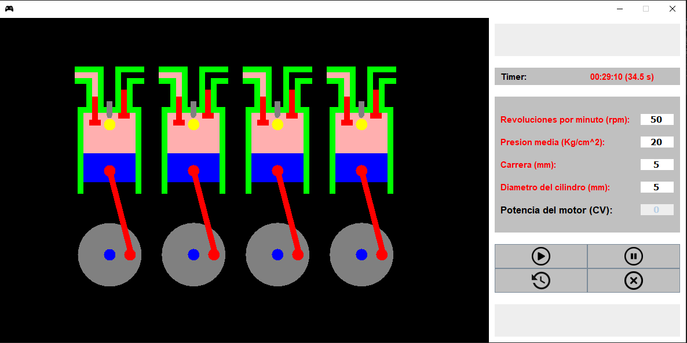

# ENGINE

## Simulador de Motor de Combustión Interna

Este es un simulador de un motor de combustión interna desarrollado en Java. El simulador permite ajustar diferentes parámetros del motor, como las revoluciones por minuto (RPM), la carrera del cilindro, el diámetro del cilindro, y la presión media del motor. Con estos parámetros, el programa simula el funcionamiento del motor y calcula la potencia desarrollada.

## Requisitos

- Java Development Kit (JDK) instalado en tu sistema.
- IDE Java para compilar y ejecutar el código.
- Librerías estándar de Java.

## Instrucciones de Uso

1. Clona o descarga el repositorio en tu sistema local.
2. Abre el proyecto en tu IDE Java.
3. Compila y ejecuta el archivo `Engine.java`.
4. Se abrirá una ventana de simulación donde podrás ajustar los parámetros del motor.
5. Ingresa los valores deseados para RPM, carrera, diámetro del cilindro y presión media.
6. Haz clic en el botón de "Nuevo Juego" para iniciar la simulación.
7. Observa la simulación del motor y los cálculos de potencia en tiempo real.
8. Puedes pausar, reiniciar o detener la simulación según sea necesario.

## Funcionalidades

- **Simulación en Tiempo Real:** Observa el funcionamiento del motor y los cambios en la potencia en tiempo real.
- **Ajuste de Parámetros:** Modifica las RPM, la carrera, el diámetro del cilindro y la presión media para explorar diferentes configuraciones del motor.
- **Cálculo de Potencia:** El programa calcula la potencia desarrollada por el motor en función de los parámetros ingresados.
- **Interfaz Gráfica Intuitiva:** La interfaz de usuario es fácil de entender y permite una interacción sencilla con el simulador.

## Imagenes de la aplicación

### Interfaz

    

### Ingresando parámetros

    

### Simulando

    

