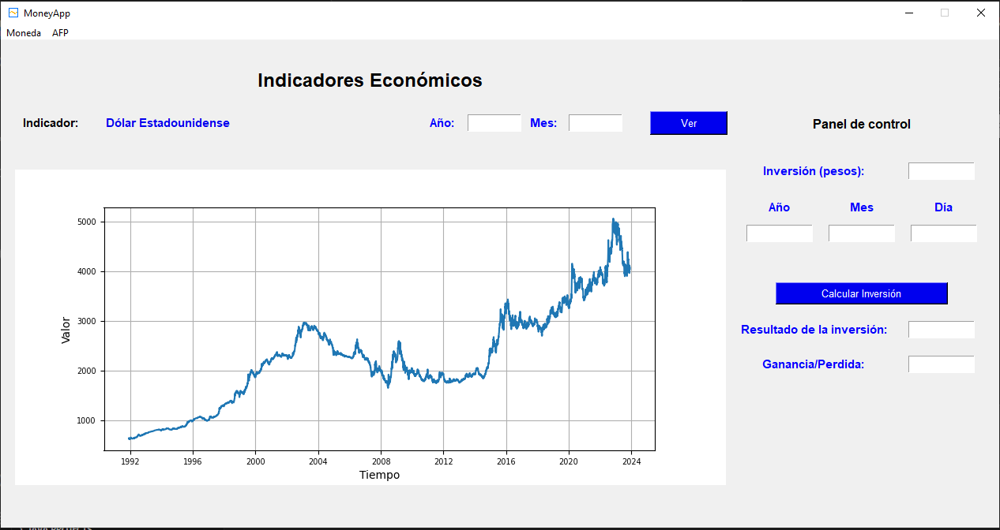
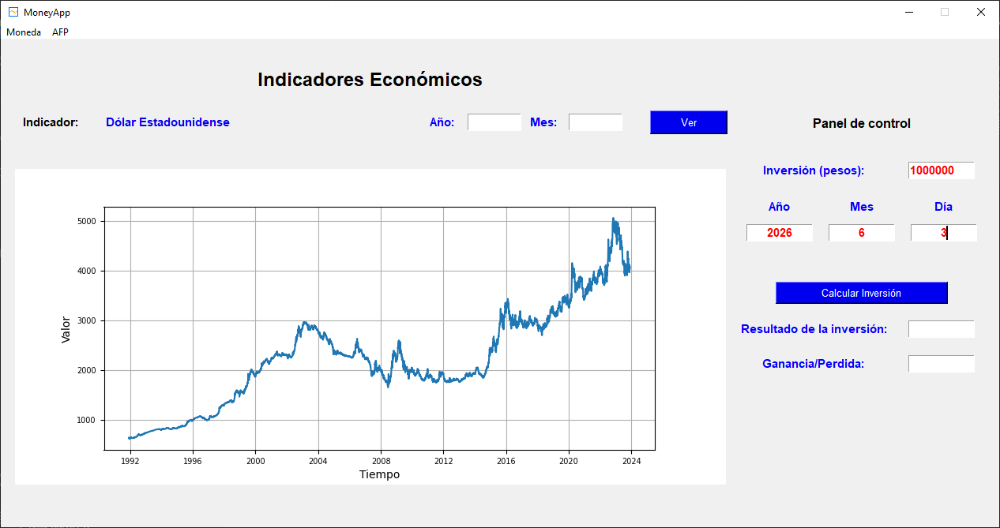
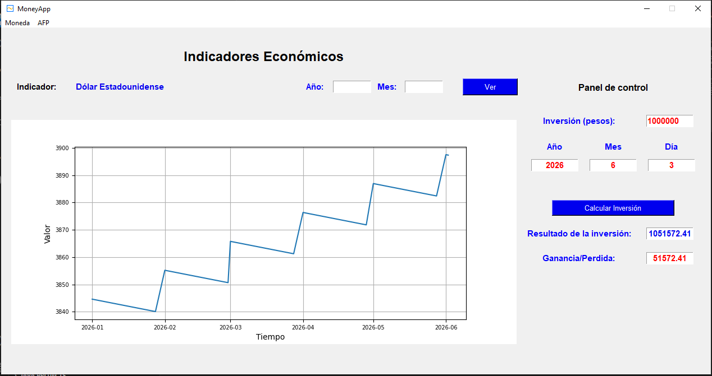

**MoneyApp**

**Autor:**

Desarrollado por [Alexander Maestre Torres] - [ajmaestretorres@gmail.com]


**Descripción:**

MoneyApp es una aplicación de escritorio diseñada para calcular inversiones financieras y visualizar datos económicos de diferentes indicadores y fondos de pensiones. La aplicación ofrece una interfaz gráfica de usuario intuitiva desarrollada utilizando la biblioteca Tkinter de Python y Matplotlib para la visualización de datos.

**Características:**

- **Cálculo de Inversiones:** Permite al usuario calcular inversiones financieras ingresando la cantidad de inversión, la fecha de inversión y otros parámetros relevantes.

- **Visualización de Datos Económicos:** Proporciona gráficos interactivos para visualizar datos económicos de diferentes indicadores y fondos de pensiones.

- **Selección de Indicadores Económicos:** Permite al usuario seleccionar entre una variedad de indicadores económicos, como el dólar estadounidense, y diferentes fondos de pensiones para visualizar datos específicos.

**Requisitos:**

- Python 3.x
- Bibliotecas: Tkinter, Matplotlib, PIL (Python Imaging Library), pandas, NumPy

**Instrucciones de Uso:**

1. Clona o descarga el repositorio de MoneyApp.
2. Instala las dependencias requeridas utilizando pip:
   ```
   pip install -r requirements.txt
   ```
3. Ejecuta el archivo principal `moneyapp.py` para iniciar la aplicación.

**Estructura del Código:**

El código de MoneyApp se organiza en varios archivos y directorios:

- **`moneyapp.py`**: El archivo principal que contiene la lógica principal de la aplicación y la configuración de la interfaz gráfica de usuario.
- **`load_data_dolar.py`**: Archivo que contiene funciones para cargar datos económicos, como el precio del dólar.
- **`window_col.py`**: Módulo que proporciona funciones para mostrar marcos específicos para diferentes indicadores y fondos de pensiones.
- **`dataset/`**: Directorio que contiene conjuntos de datos económicos en formato CSV utilizados por la aplicación.
- **`images/`**: Directorio que contiene imágenes, como el ícono de la aplicación.


## Imagenes de la aplicación

### Interfaz
<div>
    
</div>

### Ingresando parámetros
<div>
    
</div>

### Simulando
<div>
    
</div>
