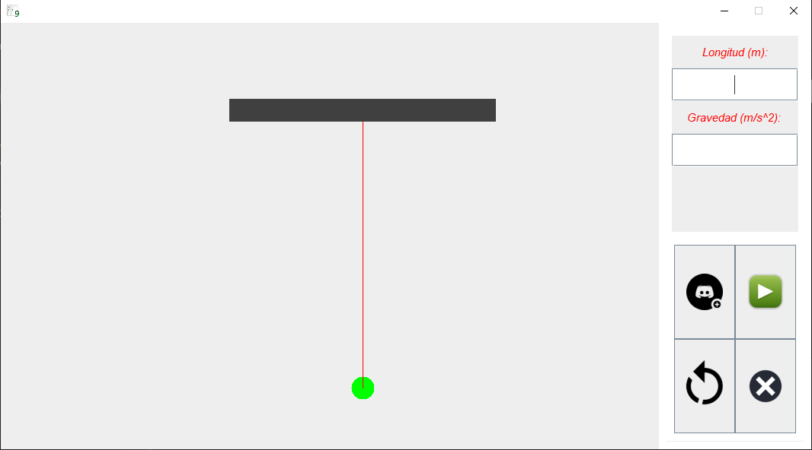
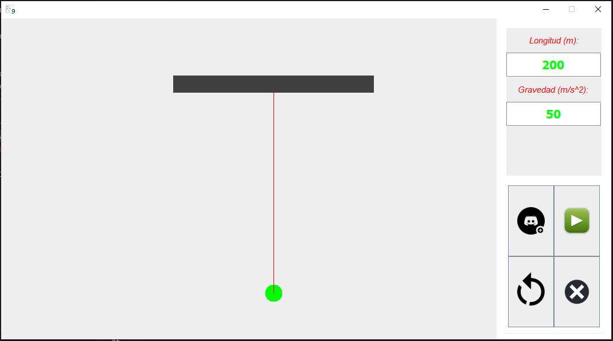
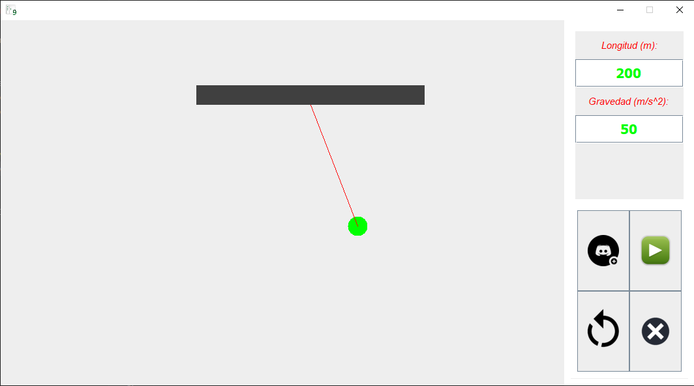

# Simulador de Péndulo

Este es un programa simple que simula el movimiento de un péndulo. Utiliza una interfaz gráfica construida con Swing en Java para permitir al usuario ingresar la longitud del péndulo y la gravedad, y luego visualizar el movimiento resultante del péndulo.

## Características

- **Interfaz Gráfica:** La aplicación presenta una interfaz gráfica donde el usuario puede ingresar los parámetros del péndulo y controlar la simulación.
- **Configuración de Parámetros:** Permite al usuario ingresar la longitud del péndulo y la gravedad para personalizar la simulación.
- **Control de Simulación:** Los botones proporcionados permiten iniciar, pausar, reiniciar y salir de la simulación.
- **Visualización en Tiempo Real:** Muestra una representación visual del movimiento del péndulo en tiempo real.

## Uso

Para ejecutar la simulación:

1. Ejecuta el programa `Pendulo.java`.
2. Ingresa la longitud del péndulo en metros y la gravedad en metros por segundo al cuadrado en los campos correspondientes.
3. Haz clic en el botón "Nuevo Juego" para iniciar la simulación.
4. Utiliza los botones provistos para pausar, reiniciar o salir de la simulación según sea necesario.

## Requisitos

- Java Development Kit (JDK) instalado en tu sistema.

## Créditos

Este programa fue desarrollado por [Alexander Mestre Torres].

## Imagenes de la aplicación

### Interfaz

    

### Ingresando parámetros

    

### Simulando

    

