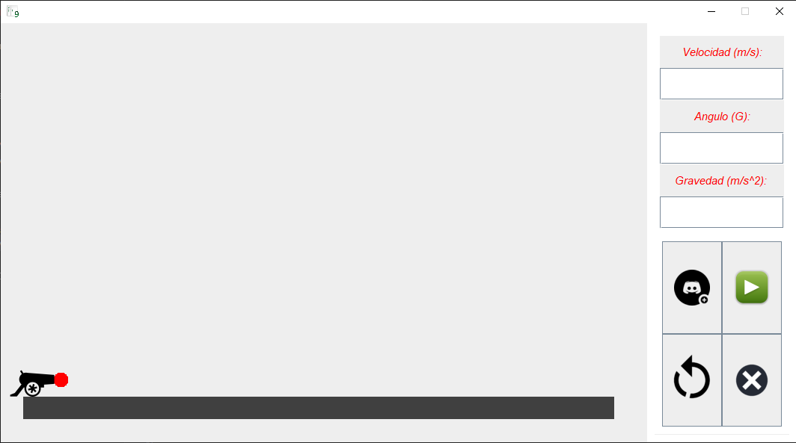
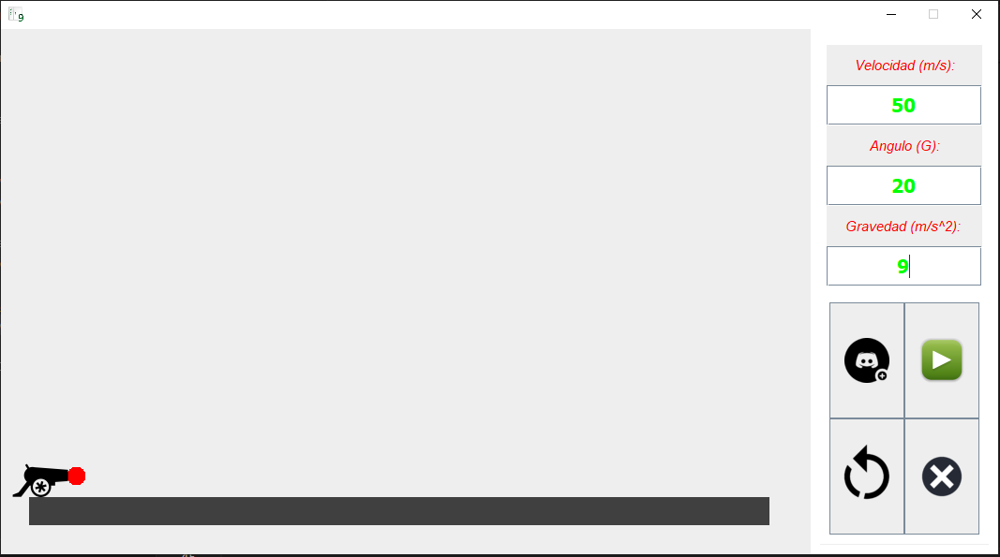
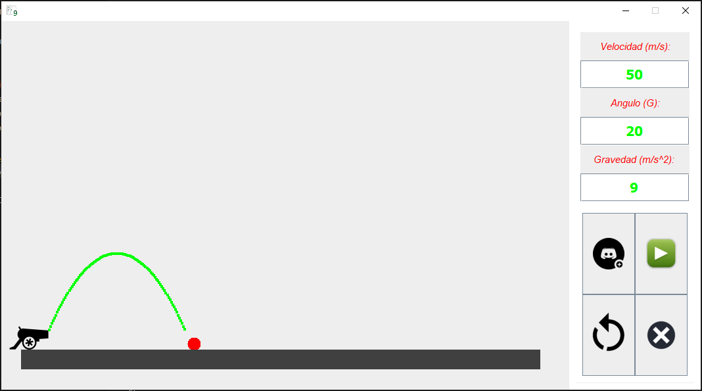

# Simulador de Tiro Parabólico

Este programa simula el movimiento de un proyectil lanzado en un tiro parabólico. Permite al usuario ingresar la velocidad inicial, el ángulo de lanzamiento y la gravedad, y luego visualizar el movimiento del proyectil en tiempo real.

## Características

- **Interfaz Gráfica:** La aplicación presenta una interfaz gráfica donde el usuario puede ingresar los parámetros del lanzamiento y controlar la simulación.
- **Configuración de Parámetros:** Permite al usuario especificar la velocidad inicial, el ángulo de lanzamiento y la gravedad para personalizar la simulación.
- **Control de Simulación:** Proporciona botones para iniciar, pausar, reiniciar y salir de la simulación.
- **Visualización en Tiempo Real:** Muestra una representación visual del movimiento del proyectil y su trayectoria en tiempo real.

## Uso

Para ejecutar la simulación:

1. Ejecuta el programa `MainClass.java`.
2. Ingresa la velocidad inicial en metros por segundo, el ángulo de lanzamiento en grados y la gravedad en metros por segundo al cuadrado en los campos correspondientes.
3. Haz clic en el botón "Nuevo Juego" para iniciar la simulación.
4. Utiliza los botones provistos para pausar, reiniciar o salir de la simulación según sea necesario.

## Requisitos

- Java Development Kit (JDK) instalado en tu sistema.

## Créditos

Este programa fue desarrollado por [Alexander Maestre Torres].

## Imagenes de la aplicación

### Interfaz

    

### Ingresando parámetros

    

### Simulando

    

