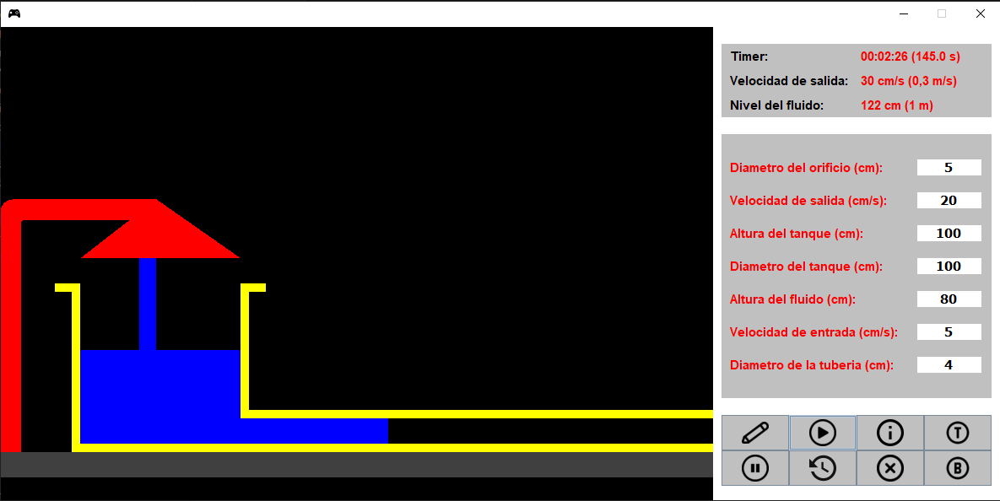

# Toricelli

## Simulación de Tanque de Fluidos

Este código simula el comportamiento de un tanque de fluidos bajo distintas condiciones y parámetros. Proporciona una interfaz gráfica para visualizar la simulación y ajustar los valores de entrada.

## Requisitos

Para ejecutar este código, necesitarás tener instalado Java en tu sistema.

## Ejecución

1. Compila el código utilizando el compilador de Java.
2. Ejecuta el archivo compilado para iniciar la simulación.

## Funcionalidades

- **Dibujar Tanque**: Permite dibujar el tanque con los parámetros ingresados.
- **Nuevo Juego**: Inicia una nueva simulación con los parámetros actuales.
- **Información**: Proporciona información sobre la ley de Torricelli en el caso de la simulación específica.
- **Detener Juego**: Pausa la simulación en cualquier momento.
- **Reiniciar Juego**: Restablece la simulación a sus valores iniciales.
- **Salir**: Cierra la aplicación.

## Descripción del Código

El código está estructurado en varias clases y métodos que gestionan la simulación y la interfaz gráfica:

- **Panel**: Clase principal que extiende `JPanel` y define la interfaz gráfica.
- **Funciones de Simulación**: Métodos para calcular el nivel del fluido, la velocidad de salida, el caudal, etc.
- **Funciones de Interfaz**: Métodos para dibujar el tanque, el fluido, la manguera, manejar los eventos de los botones, etc.

## Créditos

Este programa fue desarrollado por [Alexander Maestre Torres].

## Imagenes de la aplicación

### Interfaz

    

### Ingresando parámetros

    

### Simulando

    

